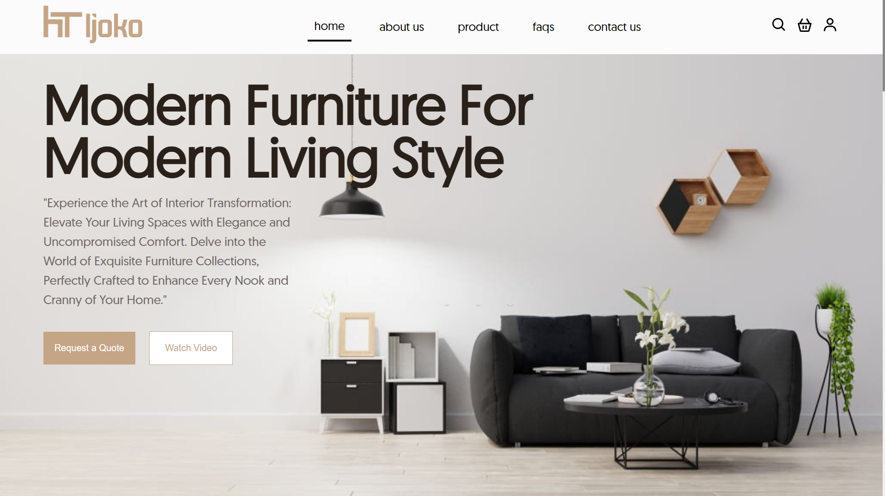
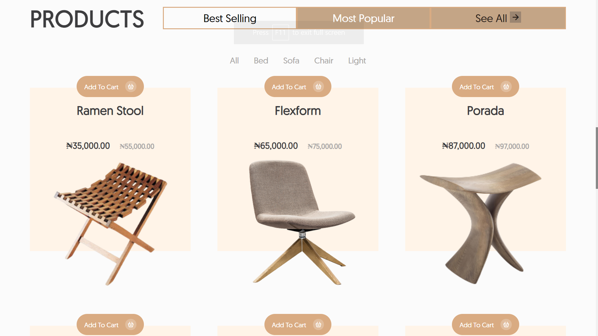
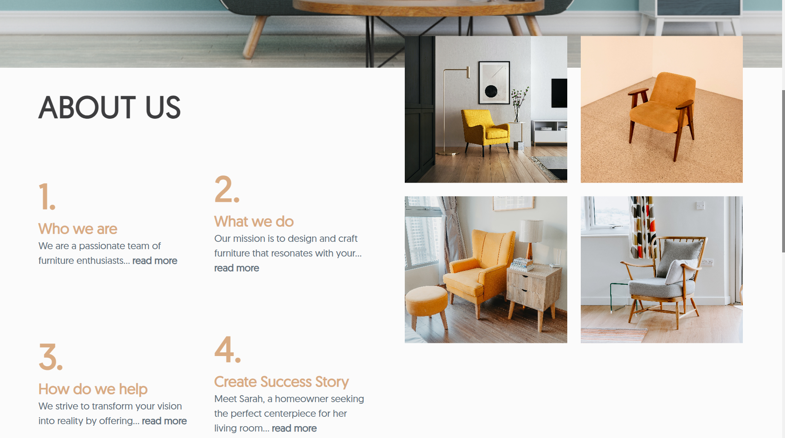
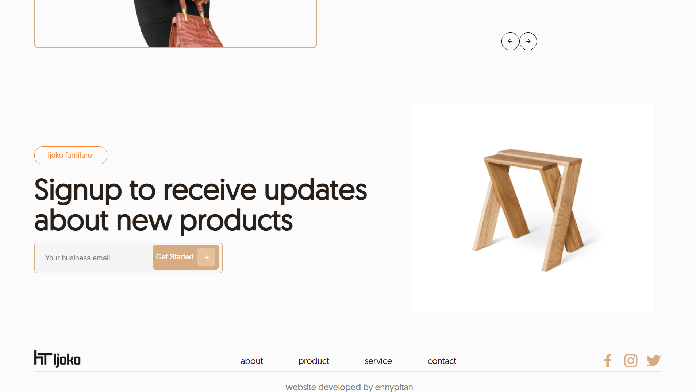

# Ijoko

Welcome to **Ijoko**, your go-to destination for discovering exquisite furniture designs. Ijoko is a showcase of unique and stylish furniture pieces crafted with a blend of creativity and functionality. Explore our collection and elevate your living spaces with our curated designs.Ijoko is a web platform dedicated to showcasing a diverse range of furniture designs that cater to various tastes and preferences. From minimalist aesthetics to bold and vibrant styles, our collection has something for everyone. Our mission is to inspire and help you transform your spaces into captivating environments.

## Features

- Diverse Designs: Explore a vast collection of furniture designs, ranging from modern and contemporary to classic and timeless pieces.

- Responsive Interface: Enjoy a seamless browsing experience across different devices with our responsive web design.

- Interactive Gallery: Immerse yourself in an interactive gallery that lets you visualize how each furniture piece can enhance your living spaces.

- User-Friendly Navigation: Navigate effortlessly through our website with an intuitive and user-friendly interface.

## Built With

Ijoko is built using the following technologies:

- **HTML5** - for structuring the web pages.
- **CSS3** - for styling and layout.
- **JavaScript** - for interactive and dynamic features.

[ Live project @ https://ijoko.netlify.app/](https://ijoko.netlify.app/)

